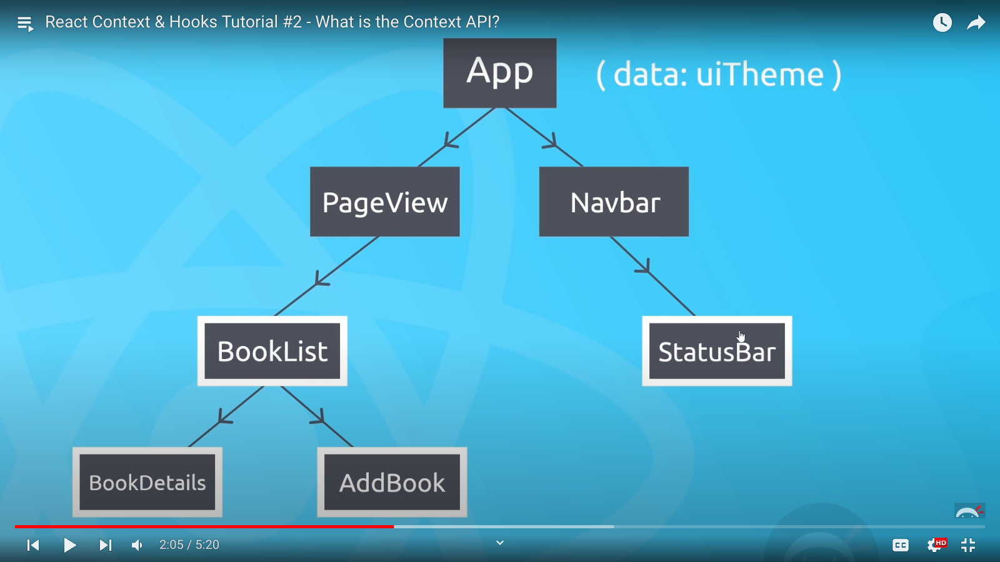

# React-Context-Hooks

## 2. Context API

https://www.youtube.com/watch?v=XkBB3pPY3t8&list=PL4cUxeGkcC9hNokByJilPg5g9m2APUePI&index=2

- share state with in a component tree.

If the marked components here want to use this *data:uiTheme*. Normally we pass down the data as props through every single component. This approach can be messy when there is lot of components in the chain. Context API solves this problem.

1. Create a *context*.
2. Provide it to component using *context provider*.

## 3. Adding a Context & Provider

https://www.youtube.com/watch?v=CGRpfIUURE0&list=PL4cUxeGkcC9hNokByJilPg5g9m2APUePI&index=3

